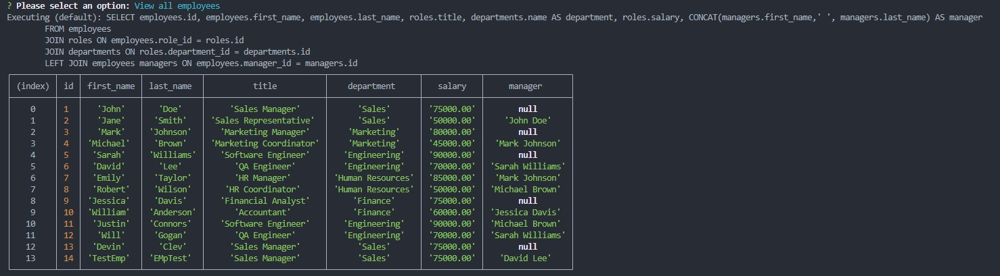
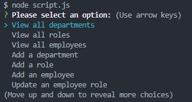

# Employee-Tracker
Employee tracker using nodeJS and MySQL 


## Usage
To track/Update/add employee's to your database.

## How To Use
Download the Repo to your local machine or fork it whichever you prefer. 
When you have it open in your editor, install all modules with ```npm install```. 
Start MySQL terminal and run the ```schema.sql``` and then ```seeds.sql``` inside of ```assets/db/```. 
Navigate to the js folder in your terminal and run ```node script.js```. 

## Youtube Video
https://www.youtube.com/watch?v=MqCySpb_bhU

## TO:DO
Add some more functionality/Input checking/General QoL stuff

## Menu


